<div align="center">

# 🕵️ Fraud Graph Anomaly Intelligence

### E-Commerce Fraud Detection with Graph Anomaly Detection, Neural Fraud Classification, Temporal Analysis, and Investigator Workflows

[](https://graph-anomaly-supervised-neural-prediction-v1.streamlit.app/)
[](https://github.com/Harshithpatali/Graph-anomaly-supervised-neural-prediction)
[](https://www.python.org/)
[](https://pytorch.org/)
[](https://scikit-learn.org/)
[](https://streamlit.io/)
[](https://plotly.com/)


</div>

A portfolio-grade e-commerce fraud intelligence system combining **unsupervised graph anomaly detection** with a **supervised neural fraud classifier**, exposed through an investigator-oriented Streamlit dashboard.

---

## 📌 Table of Contents

- [Key Metrics at a Glance](#-key-metrics-at-a-glance)
- [Two Complementary Modeling Tracks](#-two-complementary-modeling-tracks)
- [Live Application](#-live-application)
- [Project Objective](#-project-objective)
- [System Architecture](#-system-architecture)
- [Modeling Philosophy](#-modeling-philosophy)
- [Track B — Supervised Neural Fraud Detection](#-track-b--supervised-neural-fraud-detection)
- [Dataset](#-dataset)
- [Temporal Regime Shift](#️-temporal-regime-shift)
- [Development Split](#-development-split)
- [Final Neural Model](#-final-neural-model)
- [Decision Threshold](#️-decision-threshold)
- [Precision vs Recall](#-precision-vs-recall)
- [Investigator Workflow](#-investigator-workflow)
- [Supervised Fraud Detection Dashboard](#️-supervised-fraud-detection-dashboard)
- [Risk Bands](#-risk-bands)
- [New Transaction Prediction](#-new-transaction-prediction)
- [Model Artifacts](#-model-artifacts)
- [Project Structure](#-project-structure)
- [Notebook Workflow](#-notebook-workflow)
- [Notebook 13 — Neural Fraud Detection](#-notebook-13--neural-fraud-detection)
- [Evaluation Philosophy](#-evaluation-philosophy)
- [Data Leakage Controls](#-data-leakage-controls)
- [Why Two Models?](#-why-two-models)
- [Limitations](#️-limitations)
- [Installation](#️-installation)
- [Run the Streamlit Application](#️-run-the-streamlit-application)
- [Required Runtime Artifacts](#-required-runtime-artifacts)
- [Running the Notebooks](#-running-the-notebooks)
- [Reproducibility](#-reproducibility)
- [Training-to-Serving Contract](#-training-to-serving-contract)
- [Example Investigation Scenario](#-example-investigation-scenario)
- [Design Principles](#-design-principles)
- [Technology Stack](#️-technology-stack)
- [Links](#-links)
- [Author](#-author)
- [Final Takeaway](#-final-takeaway)

---

## 📊 Key Metrics at a Glance

Final locked-test performance of the supervised neural champion (PyTorch MLP):


| Metric | Result |
|---|---:|
| Threshold | **0.937358** |
| PR-AUC | **0.695629** |
| ROC-AUC | **0.829392** |
| Accuracy | **0.955927** |
| Precision | **0.979505** |
| Recall | **0.540528** |
| F1 | **0.696629** |
| Balanced Accuracy | **0.769680** |

The model is deliberately **high-precision / conservative-recall**: it rarely flags a legitimate transaction as fraud, but knowingly misses some fraud in exchange for that reliability — full reasoning in [Precision vs Recall](#-precision-vs-recall).

---

## 🧭 Two Complementary Modeling Tracks

<table>
<tr>
<th align="left">🕸️ Track A — Graph Anomaly (Unsupervised)</th>
<th align="left">🧠 Track B — Neural Fraud Classifier (Supervised)</th>
</tr>
<tr>
<td valign="top">

- Detects unusual transaction and entity behavior **without** using the fraud label during training
- Models relationships among users, devices, IP addresses, and transaction activity
- Produces anomaly scores and rankings for investigation
- Uses fraud labels **only** for post-hoc validation

</td>
<td valign="top">

- Learns directly from historical fraud labels
- Uses a **PyTorch MLP** as the final neural champion
- Uses **PR-AUC** as the primary model-selection metric
- Selects the decision threshold on validation data before locked test evaluation
- Saves the complete feature-engineering / preprocessing / model contract
- Supports manual scoring of a brand-new transaction

</td>
</tr>
</table>

The result is an end-to-end fraud intelligence system spanning data audit, temporal analysis, graph construction, feature engineering, anomaly detection, supervised learning, model evaluation, artifact management, and investigator workflows.

---

## 🚀 Live Application

<div align="center">

**[▶️ Open the Live Streamlit Application](https://graph-anomaly-supervised-neural-prediction-v1.streamlit.app/)**
&nbsp;·&nbsp;
**[💻 View the GitHub Repository](https://github.com/Harshithpatali/Graph-anomaly-supervised-neural-prediction)**

</div>

### Main application areas

| | Section |
|---|---|
| 🏠 | **Overview** |
| 📊 | **Data Explorer** |
| 🕸️ | **Graph Insights** |
| 🚨 | **Anomaly Ranking** |
| 🔍 | **Investigation Workbench** |
| 🛡️ | **Fraud Detection Model** |
| 📈 | **Model Performance** |
| ℹ️ | **About** |

The **Fraud Detection Model** section contains two workflows:

### Model Report

A locked test-set report based on `artifacts/final_test_predictions.csv`.

> The dashboard does not retrain the model and does not use the locked test set for model selection.

### New Transaction Prediction

An investigator can enter a transaction manually — no CSV upload required:

`User ID` · `Signup time` · `Purchase time` · `Purchase value` · `Device ID` · `Source` · `Browser` · `Sex` · `Age` · `IP address`

The saved neural artifact returns: **fraud probability**, **risk level**, **decision threshold**, **fraud / legitimate decision**, **model name**, and the **transaction details sent to the model**.

---

## 🎯 Project Objective

E-commerce fraud is not purely a transaction-level classification problem. A transaction can look normal in isolation but become suspicious when relationships are considered:

- multiple users sharing one device
- multiple users appearing from the same IP address
- unusual behavioral patterns
- unusual transaction timing
- unusual purchase values
- entity reuse
- combinations of otherwise ordinary signals

At the same time, a supervised classifier can learn direct relationships between transaction attributes and the historical fraud label. This project therefore asks **two different questions**:

> 🕸️ **Unsupervised —** Does this transaction or entity behave unusually compared with the rest of the system?
>
> 🧠 **Supervised —** Given historical labeled transactions, how likely is this transaction to be fraudulent?

These questions are related but not identical. Keeping them separate makes the modeling methodology more defensible.

---

## 🧠 System Architecture

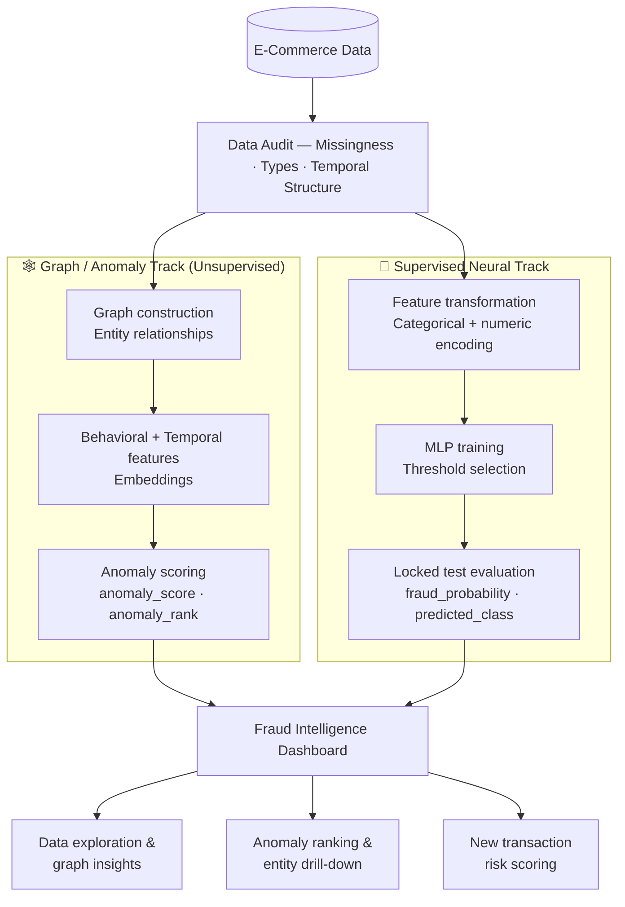

---

## 🔬 Modeling Philosophy

### Track A — Unsupervised Graph Anomaly Detection

The graph track discovers unusual behavior without using the fraud label as a training signal. The transaction ecosystem can be represented as a multipartite relationship structure:

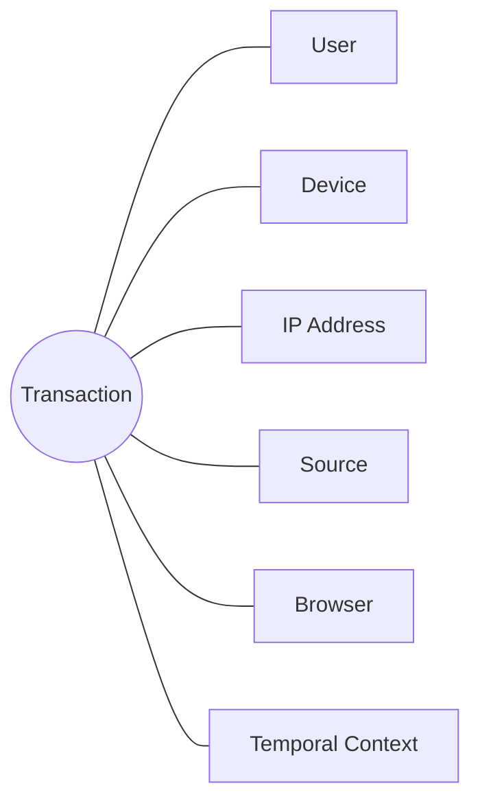

This representation exposes relationship-level behavior that a simple row-wise classifier may not capture. Potential signals include:

- one device associated with many users
- one IP associated with multiple accounts
- unusual combinations of entities
- entities connected to anomalous transactions
- behavior that is rare relative to the rest of the graph

> The anomaly score is therefore an **investigation ranking signal**, not proof of fraud.

### Scientific constraint

The fraud label is **not** used to train the anomaly model. It is used only afterward to evaluate ROC-AUC, PR-AUC, precision at a selected operating point, enrichment, and concentration of fraud near the top of the ranking.

---

## 🤖 Track B — Supervised Neural Fraud Detection

The supervised track uses the historical fraud label. The final neural champion is a **PyTorch MLP**.

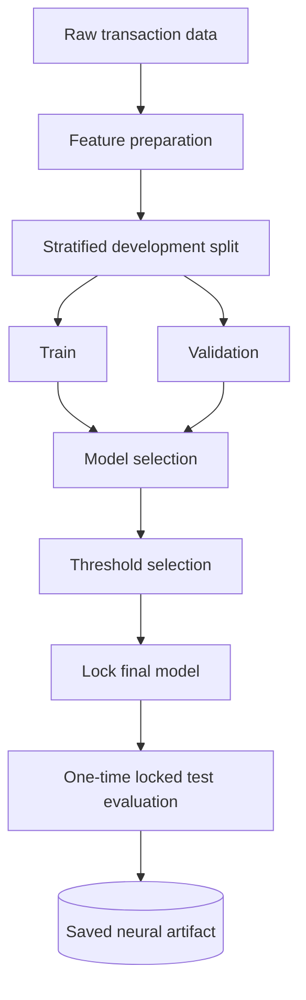

The saved artifact owns the serving contract required to transform raw transaction fields into predictions — this reduces the risk of training/serving skew.

---

## 📊 Dataset

The project uses an e-commerce fraud transaction dataset with transaction-level attributes:

| Feature | Description |
|---|---|
| `user_id` | User identifier |
| `signup_time` | Account signup timestamp |
| `purchase_time` | Transaction timestamp |
| `purchase_value` | Transaction value |
| `device_id` | Device identifier |
| `source` | Acquisition / traffic source |
| `browser` | Browser used |
| `sex` | User sex |
| `age` | User age |
| `ip_address` | IP address |
| `class` | Historical fraud label (`0` = legitimate, `1` = fraud) |

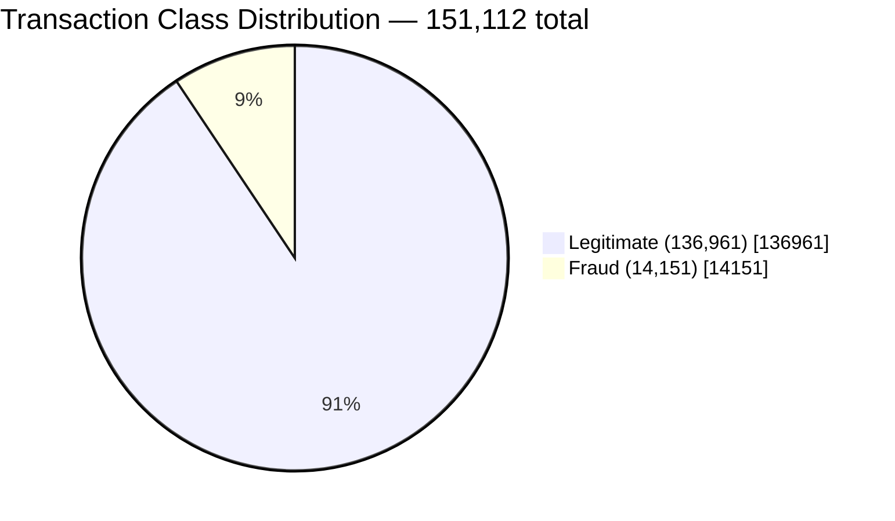

```text
Legitimate  ██████████████████░░  90.64%
Fraud       ██░░░░░░░░░░░░░░░░░░   9.36%
```

---

## ⚠️ Temporal Regime Shift

A major finding is that fraud behavior is **not stationary** across the dataset. January 2015 has a dramatically different fraud rate from the following months:

```text
January 2015     ███████████████░░░░░  76.49%
February onward  █░░░░░░░░░░░░░░░░░░░   ~4.5%
```

This matters because random and chronological splits answer different questions:

| Split type | Answers |
|---|---|
| **Random stratified** | Useful for controlled model development and benchmarking |
| **Chronological** | Useful for testing whether a model generalizes to future behavioral regimes |

The chronological experiments showed substantial temporal degradation. **The January regime was therefore not silently removed merely to improve model performance** — it is treated as a robustness and distribution-shift finding.

---

## 🧪 Development Split

The supervised development benchmark uses a stratified random split:

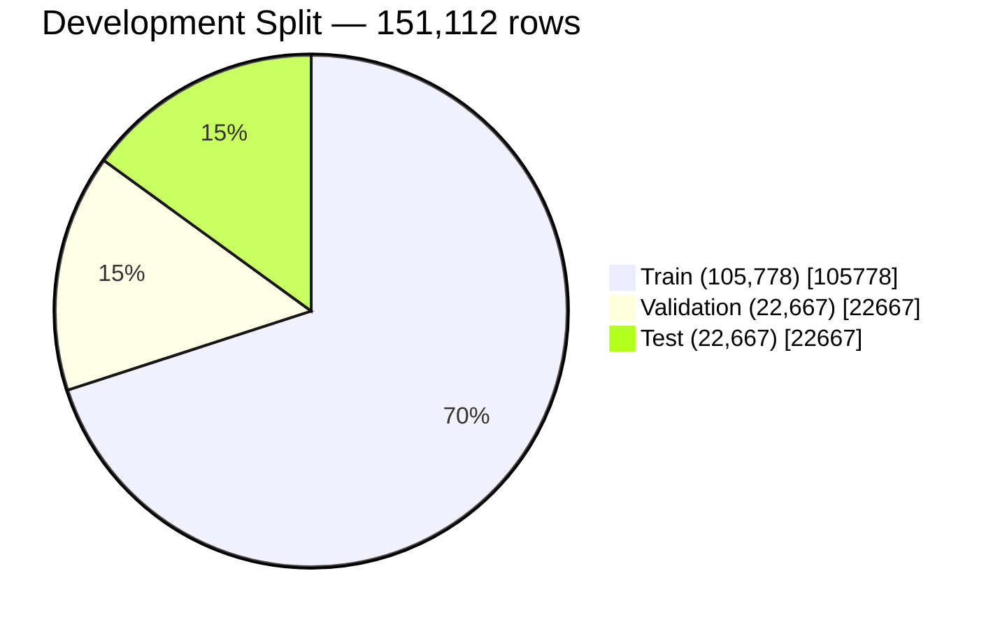

The test set remains **locked** during model development. Validation is used for model comparison, development diagnostics, and threshold selection. The final test set is evaluated only after these decisions have been frozen.

---

## 🏆 Final Neural Model

```text
Model:           MLP
Framework:       PyTorch
Primary metric:  PR-AUC
```

Final locked test results:

| Metric | Result |
|---|---:|
| Threshold | **0.937358** |
| PR-AUC | **0.695629** |
| ROC-AUC | **0.829392** |
| Accuracy | **0.955927** |
| Precision | **0.979505** |
| Recall | **0.540528** |
| F1 | **0.696629** |
| Balanced Accuracy | **0.769680** |
| True Negatives | **20,521** |
| False Positives | **24** |
| False Negatives | **975** |
| True Positives | **1,147** |

---

## 🎚️ Decision Threshold

The frozen threshold is **`0.9373584389686584`**, selected on validation data before final test evaluation.

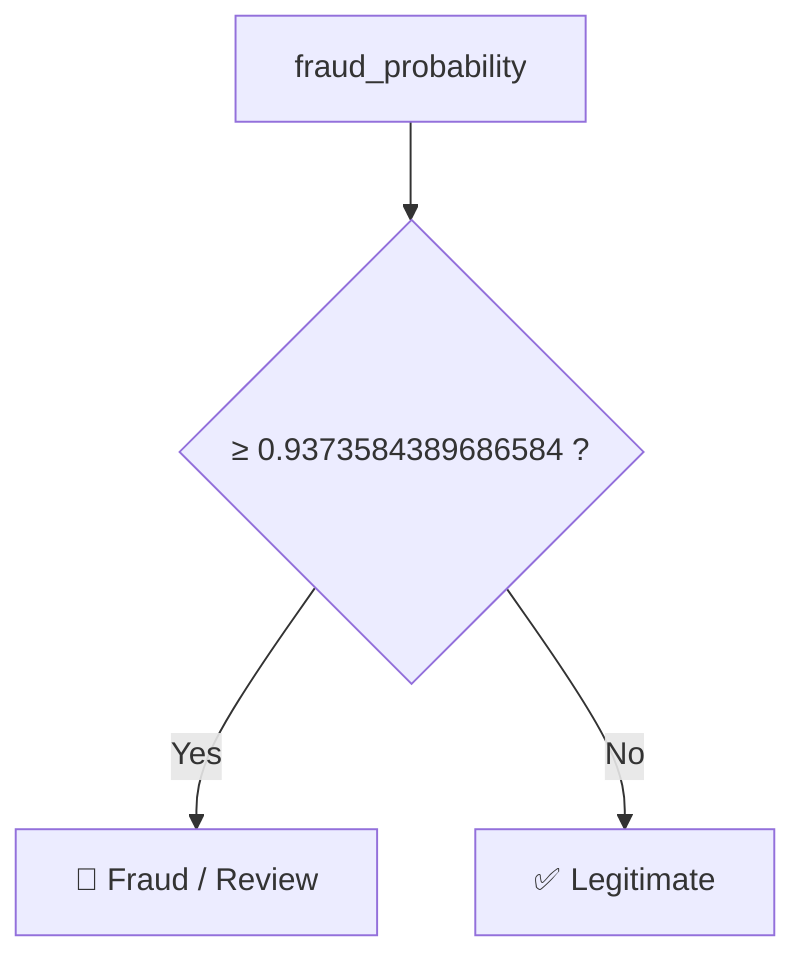

The probability should still be interpreted separately from the binary decision.

---

## 🧮 Precision vs Recall

At the selected operating threshold:

```text
Precision  ████████████████████  97.95%
Recall     ███████████░░░░░░░░░  54.05%
```

This means the model is highly selective among transactions it flags, while still missing a meaningful number of fraudulent transactions.

**Locked test confusion matrix:**

| | Predicted Legitimate | Predicted Fraud |
|---|---:|---:|
| **Actual Legitimate** | ✅ 20,521 (TN) | ⚠️ 24 (FP) |
| **Actual Fraud** | ❌ 975 (FN) | ✅ 1,147 (TP) |

- False positives = **24**
- False negatives = **975**

> This is why the application is designed as a **decision-support system**, not an autonomous fraud adjudication system.

---

## 🔎 Investigator Workflow

The dashboard is designed around an investigation workflow rather than only model metrics.

**1. Overview** — transaction volume, labeled fraud rate, unique users, unique devices, anomaly-score distribution, top anomalous transactions.

**2. Data Explorer** — exploration by country, fraud label, purchase value, transaction time, and other transaction attributes.

**3. Graph Insights** — examines relationships among:

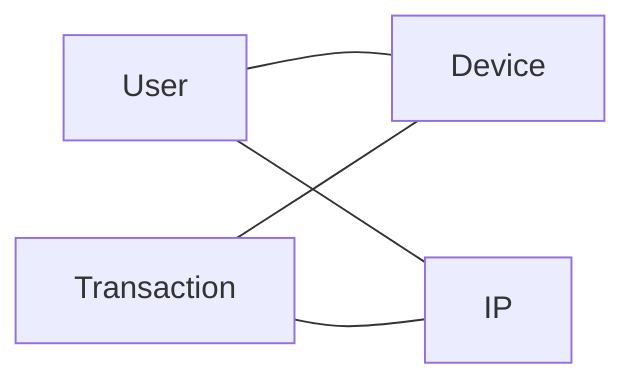

Shared devices and IP addresses provide relationship-level context.

**4. Anomaly Ranking** — ranks transactions by `anomaly_score` / `anomaly_rank`; investigators can focus on the highest-ranked transactions.

**5. Investigation Workbench** — drill-down by anomaly rank, user ID, or device ID. The selected transaction can be examined alongside anomaly score, anomaly rank, purchase value, account age, country, same-user activity, same-device activity, same-IP activity, and related transactions.

---

## 🛡️ Supervised Fraud Detection Dashboard

The supervised section contains two tabs.

### Model Report

Uses `artifacts/final_test_predictions.csv` to present: locked test size, PR-AUC, ROC-AUC, threshold, accuracy, precision, recall, F1, balanced accuracy, confusion matrix, fraud review queue, risk distribution, temporal findings, and the complete locked test data.

**Fraud Review Queue** — predicted-fraud transactions are sorted by `fraud_probability`, turning model output into an investigator-oriented queue.

---

## 🚨 Risk Bands

The UI groups probabilities into presentation bands:


| Risk Band | Probability |
|---|---:|
| 🟢 Very Low | < 10% |
| 🟡 Low | 10–25% |
| 🟠 Moderate | 25–50% |
| 🟠 Elevated | 50–75% |
| 🔴 High | 75–90% |
| 🔴 Critical | 90%+ |

These are **presentation bands**, not additional model classes — the actual binary decision still uses the frozen model threshold.

---

## 🔮 New Transaction Prediction

The application supports manual scoring without CSV upload.

**Inputs:** `User ID` · `Signup time` · `Purchase time` · `Purchase value` · `Device ID` · `Source` · `Browser` · `Sex` · `Age` · `IP address`

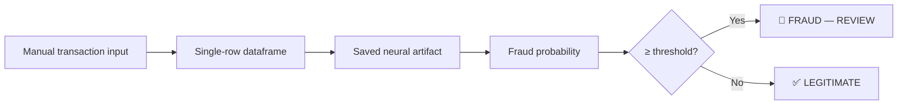

The application also displays risk band, probability, threshold, model name, and the transaction submitted to the model. **No retraining occurs during prediction.**

---

## 📦 Model Artifacts

```text
artifacts/
├── final_model.joblib
├── final_supervised_neural_model.joblib
├── final_test_predictions.csv
├── classical_models.joblib
├── classical_preprocessor.joblib
├── graph_svd.joblib
├── graph_train_embedding.npy
├── graph_validation_embedding.npy
├── train_features.parquet
├── validation_features.parquet
├── test_features.parquet
├── validation_ranked.parquet
├── investigation_ranked.parquet
├── temporal_daily_scores.parquet
├── feature_config.json
└── hybrid_config.json
```

| Artifact | Purpose |
|---|---|
| `final_model.joblib` | Frozen unsupervised graph/anomaly model and associated transformation components |
| `final_supervised_neural_model.joblib` | Final neural fraud artifact used for new transaction inference |
| `final_test_predictions.csv` | Locked test-set predictions used by the Streamlit model report |

Expected fields in `final_test_predictions.csv`:

```text
user_id, signup_time, purchase_time, purchase_value, device_id,
source, browser, sex, age, ip_address,
actual_class, fraud_probability, predicted_class
```

---

## 📁 Project Structure

```text
fraud_ecommerce_graph_anomaly_and_ml/
│
├── app/
│   └── app.py
│
├── artifacts/
│   ├── final_model.joblib
│   ├── final_supervised_neural_model.joblib
│   ├── final_test_predictions.csv
│   ├── graph_svd.joblib
│   ├── graph_train_embedding.npy
│   ├── graph_validation_embedding.npy
│   ├── train_features.parquet
│   ├── validation_features.parquet
│   ├── test_features.parquet
│   ├── validation_ranked.parquet
│   ├── investigation_ranked.parquet
│   └── temporal_daily_scores.parquet
│
├── data/
│   ├── raw/
│   └── processed/
│       └── dashboard.parquet
│
├── notebooks/
│   ├── 01_...
│   ├── 02_...
│   ├── ...
│   ├── 11_...
│   ├── 12_...
│   └── 13_...
│
├── reports/
│   ├── data_audit.json
│   ├── initial_data_profile.json
│   ├── graph_profile.json
│   ├── final_test_evaluation.json
│   ├── model_card.md
│   └── synthetic_stress_test.csv
│
├── src/
│   ├── anomaly.py
│   ├── data_utils.py
│   ├── embeddings.py
│   ├── evaluation.py
│   ├── final_pipeline.py
│   ├── graph_features.py
│   ├── graph_utils.py
│   ├── pipeline_utils.py
│   ├── supervised_fraud.py
│   └── temporal_features.py
│
├── requirements.txt
├── README.md
└── ...
```

---

## 📓 Notebook Workflow

The project follows a progressive analytical workflow.

```mermaid
flowchart LR
    N1[01 Data Audit] --> N2[02 Temporal EDA] --> N3[03 Graph Construction] --> N4[04 Feature Engineering] --> N5[05 Statistical Baselines]
    N5 --> N6[06 Classical ML] --> N7[07 Embeddings] --> N8[08 Temporal Anomaly] --> N9[09 Hybrid Scoring] --> N10[10 Synthetic Stress Test]
    N10 --> N11[11 Final Evaluation] --> N12[12 Investigation / Explainability] --> N13[13 Neural Fraud Detection]
```

### Unsupervised / Graph Track

| Notebook | Focus |
|---|---|
| **01 — Data Audit** | Dataset shape, data types, missing values, duplicates, target distribution, data quality |
| **02 — Temporal EDA** | Transaction timing, fraud over time, temporal concentration, regime changes, daily/monthly behavior |
| **03 — Graph Construction / Network EDA** | Builds transaction/entity relationships; shared devices, shared IPs, graph connectivity, entity reuse |
| **04 — Node / Behavioral Feature Engineering** | Creates graph-derived and behavioral signals |
| **05 — Statistical Anomaly Baselines** | Establishes simpler anomaly baselines |
| **06 — Classical Unsupervised ML** | Benchmarks classical anomaly-detection approaches |
| **07 — Graph Representation / Embeddings** | Builds graph representations and embeddings |
| **08 — Temporal Anomaly Detection** | Adds time-aware anomaly analysis |
| **09 — Hybrid Scoring / Ablation** | Investigates combinations of anomaly signals and their contribution |
| **10 — Synthetic Anomaly Stress Testing** | Tests anomaly methods using controlled synthetic perturbations |
| **11 — Final Evaluation / Model Freeze** | Produces the final anomaly artifact |
| **12 — Investigation / Explainability** | Converts model output into investigator-oriented analysis |

---

## 🧠 Notebook 13 — Neural Fraud Detection

Notebook 13 focuses on the supervised neural track.

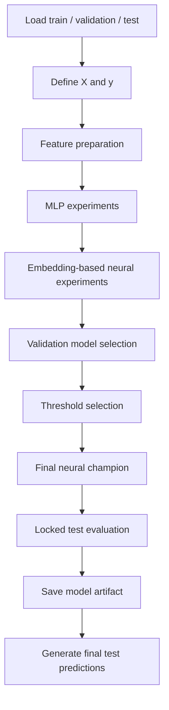

Final artifact: `artifacts/final_supervised_neural_model.joblib`
Final locked prediction file: `artifacts/final_test_predictions.csv`

---

## 🧪 Evaluation Philosophy

The project separates **Training** (model learns from training data), **Validation** (model comparison, hyperparameter decisions, threshold selection), and **Test** (used only after the model and threshold have been frozen). This prevents the final test set from becoming an iterative tuning dataset.

---

## 🔐 Data Leakage Controls

| Component | Control |
|---|---|
| Unsupervised model | The fraud label is not used as an input to anomaly-model training — used only for post-hoc validation |
| Supervised model | The test set is not used for model selection, threshold selection, or iterative tuning |
| Dashboard | The locked test report reads `final_test_predictions.csv` rather than repeatedly regenerating the test predictions |

---

## 📈 Why Two Models?

The two tracks provide complementary evidence.

| | 🕸️ Anomaly Model | 🧠 Supervised Classifier |
|---|---|---|
| **Answers** | Is this behavior unusual? | Does this transaction resemble historically labeled fraud? |
| **Strength** | Can surface unusual or novel behavior | Directly learns historical fraud patterns |
| **Limitation** | Anomalous does not necessarily mean fraudulent | Can struggle with novel fraud strategies and distribution shift |

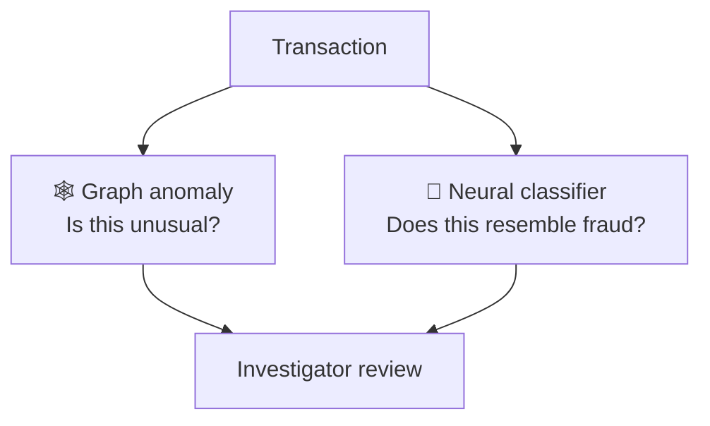

---

## ⚠️ Limitations

1. **Temporal drift** — performance on random splits may not represent future performance because fraud behavior changes over time.
2. **False negatives** — the final neural threshold produces **975 false negatives** on the locked test set; the classifier should not be treated as a complete fraud filter.
3. **Historical-label dependence** — the supervised model learns from historical fraud labels; label quality and historical investigation policies can influence the learned decision boundary.
4. **Novel fraud** — previously unseen attack strategies may not resemble historical fraud examples; the graph anomaly track provides a complementary mechanism for surfacing unusual behavior.
5. **Manual prediction** — a dashboard prediction is not confirmation of fraud. Investigators should combine model probability, graph relationships, transaction history, temporal context, business rules, and other available evidence.

---

## 🛠️ Installation

### 1. Clone the repository

```bash
git clone https://github.com/Harshithpatali/Graph-anomaly-supervised-neural-prediction.git
cd Graph-anomaly-supervised-neural-prediction
```

### 2. Create a virtual environment

**Windows**

```powershell
python -m venv .venv
.\.venv\Scripts\Activate.ps1
```

**macOS / Linux**

```bash
python3 -m venv .venv
source .venv/bin/activate
```

### 3. Install dependencies

```bash
pip install -r requirements.txt
```

Core technologies: `pandas` · `numpy` · `scipy` · `scikit-learn` · `torch` · `plotly` · `matplotlib` · `streamlit` · `joblib` · `jupyter` · `ipykernel` · `ipywidgets`

---

## ▶️ Run the Streamlit Application

From the project root:

```bash
python -m streamlit run app/app.py
```

Or:

```bash
streamlit run app/app.py
```

Default address: `http://localhost:8501`

If the default port is occupied:

```bash
python -m streamlit run app/app.py --server.port 8504
```

Then open `http://localhost:8504`.

---

## 📦 Required Runtime Artifacts

For the complete application experience:

```text
artifacts/final_model.joblib
artifacts/final_supervised_neural_model.joblib
artifacts/final_test_predictions.csv
```

The graph dashboard also expects `data/processed/dashboard.parquet` or `data/processed/dashboard.pkl`.

---

## 📓 Running the Notebooks

Start Jupyter:

```bash
jupyter notebook
```

or:

```bash
jupyter lab
```

Run the notebooks in their intended sequence because later stages consume artifacts produced earlier:

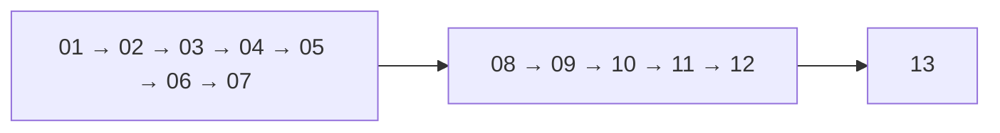

Notebook 13 is the final supervised neural modeling stage.

---

## 💾 Reproducibility

The project uses fixed random seeds where applicable and records important modeling decisions, including train/validation/test splits, model configuration, validation threshold, final metrics, and saved artifacts. The application consumes frozen artifacts rather than depending on an interactive notebook state.

---

## 🧱 Training-to-Serving Contract

A central design principle:

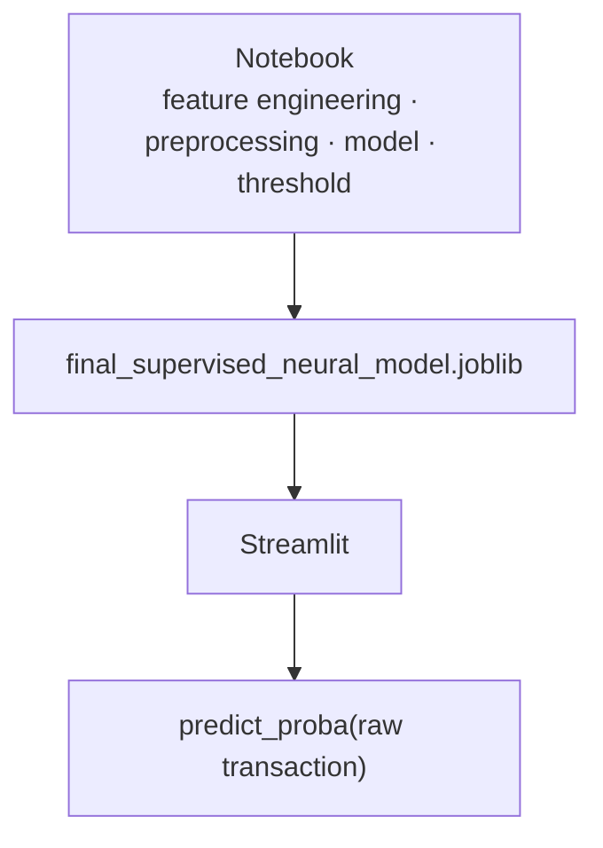

The application does not independently reproduce training-time feature engineering — this helps reduce training/serving skew.

---

## 🔍 Example Investigation Scenario

Suppose a transaction receives `Fraud probability = 0.97` against `Decision threshold = 0.937358`:

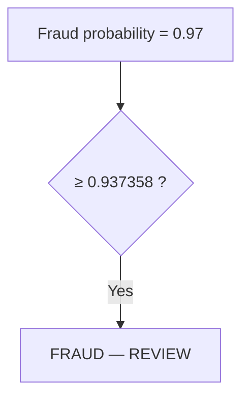

The investigator should then inspect: **1.** Transaction value **2.** User history **3.** Device reuse **4.** IP reuse **5.** Purchase timing **6.** Account age **7.** Graph anomaly rank **8.** Related transactions.

The intended operating model:

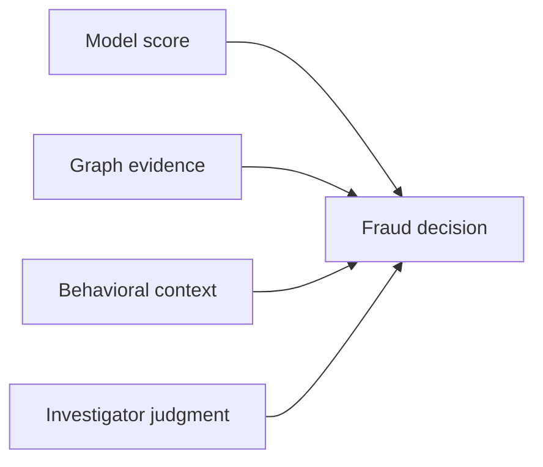

---

## 🧭 Design Principles

| # | Principle | Summary |
|---|---|---|
| 1 | Separate discovery from classification | Anomaly detection and supervised classification answer different questions |
| 2 | Prefer PR-AUC for imbalanced fraud modeling | Accuracy alone is insufficient |
| 3 | Lock the test set | Test data should not become an iterative tuning set |
| 4 | Preserve temporal findings | Distribution shift should be reported, not hidden |
| 5 | Keep inference consistent with training | The saved artifact owns the transformation contract |
| 6 | Make outputs investigator-friendly | A fraud system should produce actionable queues and context, not only a score |
| 7 | Do not equate probability with certainty | A prediction is evidence, not proof |

---

## 🛠️ Technology Stack

| Technology | Purpose |
|---|---|
| Python | Core language |
| Pandas | Data manipulation |
| NumPy | Numerical computation |
| SciPy | Scientific computation |
| scikit-learn | Evaluation and classical ML utilities |
| PyTorch | Neural fraud model |
| Joblib | Model/artifact serialization |
| Plotly | Interactive dashboard visualization |
| Matplotlib | Notebook visualization |
| Streamlit | Investigator-facing application |
| Jupyter | Research and experimentation |
| Parquet | Efficient tabular artifact storage |

---

## 🌐 Links

<div align="center">

[](https://graph-anomaly-supervised-neural-prediction-v1.streamlit.app/)
[](https://github.com/Harshithpatali/Graph-anomaly-supervised-neural-prediction)

</div>

---

## 👤 Author

**Harshith Patali**
[](https://github.com/Harshithpatali)

---

## 📌 Final Takeaway

This project demonstrates more than training a fraud classifier — it demonstrates an end-to-end fraud analytics workflow:

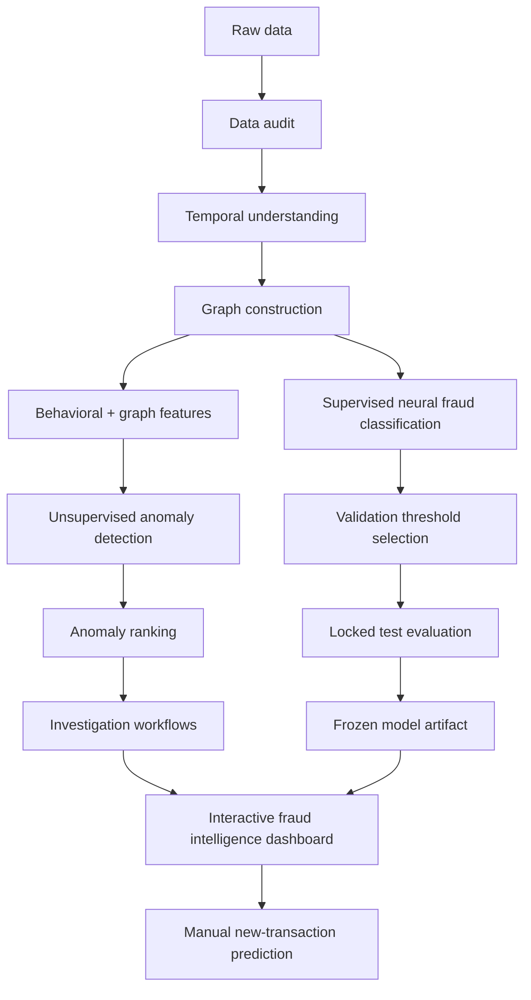

> **Use graph anomaly detection to discover unusual behavior, supervised learning to estimate fraud risk from historical evidence, and an investigator-oriented dashboard to combine those signals into an actionable workflow.**

The system is therefore intended as **fraud intelligence and decision support**, not as an autonomous fraud adjudication system.
